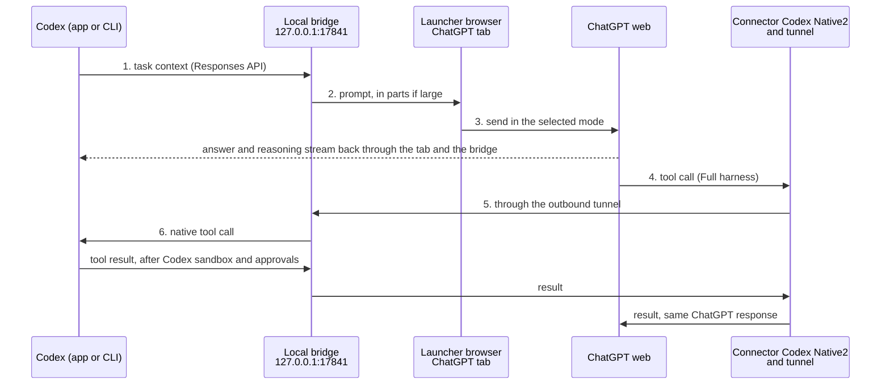
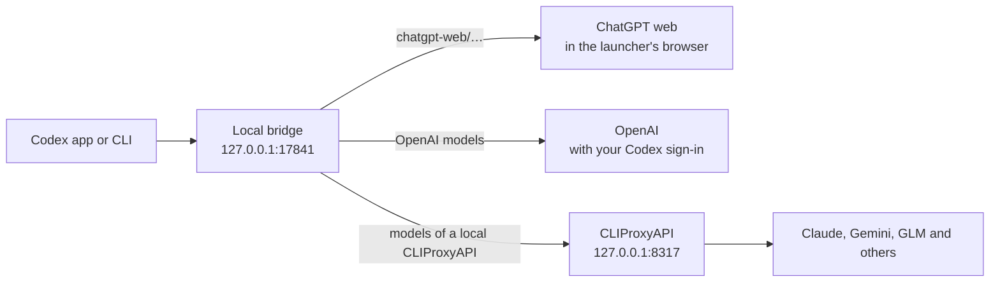

# Codex Superpower

One model list in [Codex](https://developers.openai.com/codex) (app and CLI) for everything you pay for: the ChatGPT models on your ChatGPT plan, from Instant to Pro, and, through a local [CLIProxyAPI](https://github.com/router-for-me/CLIProxyAPI), Claude, Gemini, GLM and other subscription models. Codex keeps its own sign-in, features, files, tools, approvals and tasks; a local bridge in the **Codex Superpower** desktop app sends each turn to ChatGPT web, to OpenAI, or to CLIProxyAPI.

Codex Superpower started as a fork of [miuuyy/codex-chatgpt-web](https://github.com/miuuyy/codex-chatgpt-web) (formerly `trukhinyuri/codex-chatgpt-web`). It fixes failures seen in daily use, installs from source on macOS, and keeps itself up to date from this repository's `main` branch: every update must pass the full test suite and start cleanly, or the previous build stays in place.

[Quick start](#quick-start) · [Set up with an AI agent](#set-up-with-an-ai-agent) · [How it works](#how-it-works) · [CLIProxyAPI models](#models-from-cliproxyapi) · [What this fork changes](#what-this-fork-changes) · [Updates](#updates-and-rollback) · [Problem reports](#problem-reports) · [Troubleshooting](#troubleshooting)

## Quick start

On macOS (Apple silicon or Intel) with Git, Node.js and Bun 1.4.0:

```bash
curl -fsSL https://raw.githubusercontent.com/trukhinyuri/codex-superpower/main/scripts/install-fork-macos.sh | bash
```

The script clones this repository into `~/.codex-chatgpt-web-source`, runs `bun run verify` (all tests), packages the app, installs **Codex Superpower** into `/Applications`, and ends with `RESULT installed commit=…`. It tells you exactly what to install if a prerequisite is missing.

The app shows the name Codex Superpower. Its bundle is still `/Applications/Codex Web GPT.app`, its data folder `~/Library/Application Support/Codex Web GPT` and its runtime home `~/.codex-chatgpt-web`, so the paths below keep the old name; your ChatGPT sign-in and settings carry over unchanged.

Then, in the launcher:

1. Sign in to ChatGPT in the embedded browser and run **Run browser smoke test**.
2. Press **Install models**, restart Codex once, and choose a **ChatGPT Web — …** model (Instant, Medium, High, Extra High or Pro, as your plan allows).
3. For file, terminal and patch tools, open **MCP**: create a Tunnel and an API key in the OpenAI platform, press **Connect harness**, enable ChatGPT Developer Mode, add a Tunnel connector named exactly **Codex Native2** (Authentication: None, Allow all actions), then press **Verify runtime**.
4. For long tasks, turn on **Settings → Bigger Context** and restart Codex. The Pro window grows to 336,579 tokens, with compaction at 285,000.
5. Optional: [add the models of a local CLIProxyAPI](#models-from-cliproxyapi) (Claude, Gemini, GLM and others) to the same model list.

## Set up with an AI agent

Paste one of these prompts into Codex or Claude Code on the Mac you are setting up. The agent follows [AGENTS.md](AGENTS.md). It never types passwords, codes or API keys: you sign in and paste secrets yourself.

**Install and configure**

```text
Install and configure Codex Superpower from https://github.com/trukhinyuri/codex-superpower on this Mac.
Follow the repository's AGENTS.md. Run the installer with WAIT_FOR_IDLE=1, install any prerequisite it
names, and report its RESULT line. Then use Computer Use to walk me through the launcher: I sign in to
ChatGPT and paste the Tunnel ID and API key myself; you run the smoke test, Install models, Connect
harness and Verify runtime, and tell me when to restart Codex. Finish with the checks in AGENTS.md
("Verify") and report each result, including anything that failed.
```

**Verify an existing install with Computer Use**

```text
Verify Codex Superpower on this Mac using the "Verify" section of AGENTS.md in
https://github.com/trukhinyuri/codex-superpower. Run doctor, send one test turn with a ChatGPT Web model,
and use Computer Use to screenshot the launcher's Browser view while the turn runs and confirm that the
ChatGPT composer shows the same mode as the model you chose. Do not quit the launcher while a turn is
running. Report every check as passed or failed, with the exact error text.
```

**Update without interrupting work**

```text
Update Codex Superpower to the latest main of https://github.com/trukhinyuri/codex-superpower without
interrupting running Codex work: follow the "Update" section of AGENTS.md, then run doctor and report the
installer's RESULT line.
```

## How it works



1. Codex sends the task to the local bridge exactly as it would send it to OpenAI.
2. The bridge compiles the context and hands it to a ChatGPT tab in the launcher. With Bigger Context, a large context travels in two or three messages.
3. ChatGPT answers in the mode you picked in Codex. The answer and reasoning summaries stream back to Codex.
4. In Full harness mode, ChatGPT calls Codex tools through the **Codex Native2** connector. The call reaches your Mac through an outbound tunnel, so no port is opened.
5. The bridge turns the call into a native Codex tool call. Codex runs it with its own sandbox and approvals and sends the result back into the same ChatGPT response.

Every model Codex lists goes through the same local bridge, and the bridge sends each turn to the service that owns the model. Codex keeps its built-in OpenAI provider and your sign-in, so none of its features change:



Browser-only mode stops after step 3 and has no local tools. Zero Risk mode lets you paste and send each prompt yourself. Details: [architecture](docs/architecture.md) and [security model](docs/security-model.md).

## Models from CLIProxyAPI

[CLIProxyAPI](https://github.com/router-for-me/CLIProxyAPI) serves models from other subscriptions and API keys (Claude, Gemini, GLM and more) through one local, OpenAI-compatible endpoint. Connect a CLIProxyAPI that runs on this Mac, and its models join the Codex model list next to the OpenAI and ChatGPT Web models:

```bash
printf '%s' "$CLIPROXY_API_KEY" | "/Applications/Codex Web GPT.app/Contents/Resources/runtime/bin/codex-chatgpt-web" cliproxy connect --api-key-stdin
```

- The key is read from standard input, checked against the proxy, and stored in `~/.codex-chatgpt-web/secrets/cliproxy-api-key` (owner-only). Add `--base-url http://127.0.0.1:PORT` if the proxy does not listen on 8317; only addresses on this Mac are accepted.
- Codex keeps its own OpenAI provider and ChatGPT sign-in, so its features stay on. Turns of a proxy model go to CLIProxyAPI with the proxy's key; your ChatGPT credentials never reach it. A model that OpenAI also serves stays on your own Codex sign-in.
- Compaction works for proxy models too: the bridge asks the model for the same summary Codex's own compaction would.
- `cliproxy status` shows the connection and how many proxy models Codex received; `cliproxy disconnect` removes them at Codex's next model refresh. Restart Codex to see a change at once.
- Manage the proxy's accounts from here once you add its management key (`remote-management.secret-key` in its config), again on standard input: `cliproxy management-key --stdin`, then `cliproxy accounts` (e-mail addresses masked unless `--show-emails`), `cliproxy login claude` (also `codex`, `antigravity`, `kimi`, `xai`, `devin`, `meta`; opens the provider's sign-in page and waits), and `cliproxy remove REF` (the `ref` from the list).
- The launcher's **CLIProxyAPI** section does the same with buttons: connect, add the management key, sign accounts in and remove them. Keys are cleared from the form as soon as they are sent.
- You run CLIProxyAPI itself; its [README](https://github.com/router-for-me/CLIProxyAPI) covers installation.

## What this fork changes

| Area | Upstream 5.0.8 | This fork |
| --- | --- | --- |
| Skills outside Git, or in a project with several folders | The turn fails with "ChatGPT web turn is missing cwd in trusted Codex environment context" | Works. Extra folders are trusted only when Codex itself labels the environment and the skill |
| "Too many requests" | The turn fails at once; Codex retries within seconds and deepens the limit ([#547](https://github.com/miuuyy/codex-chatgpt-web/issues/547)) | An account-wide pause of 60, 120, 240, then 300 s; Codex waits the stated delay, and no request reaches ChatGPT meanwhile |
| "Something went wrong" right after a rate limit | Retried within a second | Treated as the same limit, so Codex waits |
| Compaction during a rate limit | Fails with "ChatGPT did not complete the context handoff" ([#556](https://github.com/miuuyy/codex-chatgpt-web/issues/556)) | Returns the rate limit with its delay; Codex retries after it |
| Bigger Context | Context parts go in Instant; only the last part uses the selected mode | Every part uses the selected mode, which is checked again before the last part |
| A tool call that ChatGPT stops before it runs | The model may blame Codex auto-review or the target service | The model reports that ChatGPT stopped the call and that it never reached Codex |
| Updates | Offers upstream release packages | Installs this repository's `main` automatically after the full test suite passes, only while Codex is idle, and restores the previous build if the new one does not start cleanly |
| Installation | Release installers | `scripts/install-fork-macos.sh` builds from source; `WAIT_FOR_IDLE=1` never interrupts work |
| Fixes from the wider project | Open pull requests and forks, unmerged | About thirty fixes ported from upstream pull requests and other forks, each with a regression test: DNS-rebinding protection for the bridge, exact origin checks, no resend of a prompt ChatGPT already accepted, retry and continuation fixes, composer and effort-slider races, retained-tab and session recovery, compaction persistence, image validation, doctor evidence, a visible tray icon |
| Quitting with running turns | Cancels them | Asks first; the default keeps the launcher running |
| Other models | — | [Models from a local CLIProxyAPI](#models-from-cliproxyapi) join the same Codex model list, with Codex's own sign-in and features intact |
| Problem reports | — | [Consented GitHub issues](#problem-reports) built only from fixed codes and versions |
| AI agents | — | [AGENTS.md](AGENTS.md) runbook for setup, verification and updates |

Each fix meant for upstream lives in its own `fix/…` branch with a regression test.

## Updates and rollback

- **Automatic (default).** The launcher checks `main` every hour. A new commit installs by itself when it only adds commits to the installed build, its GitHub checks passed (or the repository runs none), and it has not failed on this Mac before. The launcher builds it at low CPU priority, runs `bun run verify`, packages it, and swaps the app after Codex has sent no request through the bridge for ten minutes. A task whose tool runs longer than that without a model request can still see one failed request, which Codex reports; continue it. The new launcher must report a healthy start within six minutes; otherwise the previous app goes back into place and that commit is never installed automatically again. Turn this off in **Settings → Automatic updates**.
- **Manual.** Any other update, for example one that failed before, appears as **Update to v5.0.8+‹commit›**. The same checks apply; it installs after 30 idle seconds.
- **From a terminal.** Rerun the quick-start command with `WAIT_FOR_IDLE=1` before `bash`. It keeps the replaced build and restores it if the new one does not start cleanly, like the launcher does.
- **Rollback.** The two builds replaced last are kept in `~/Library/Application Support/Codex Web GPT/rollback.noindex`. To put the newest one back (after Codex is idle; `LIST=1` lists them, `ENTRY=<name>` picks one):

  ```bash
  curl -fsSL https://raw.githubusercontent.com/trukhinyuri/codex-superpower/main/scripts/rollback-fork-macos.sh | bash
  ```

  Automatic updates then skip the commit you rolled back from until `main` moves on.
- **Logs.** `~/Library/Application Support/Codex Web GPT/logs/source-update.log` records every check, build step, swap and rollback.
- **Trust.** An update runs this repository's build and tests on your Mac, as the installer does. Only the maintainer can push to `main`.

## Problem reports

When an update fails to build or pass its tests, is rolled back, or the local runtime does not start, the launcher can open an issue in this repository so the maintainer can fix it. The first time, it asks and shows the exact report; choose **Always report automatically**, **Report this one**, **Not now** or **Never**, and change it later in **Settings → Report problems to the maintainer**.

- A report contains only fixed codes from a closed list, the app version and commit, the macOS version and the CPU architecture. It never contains prompts, session content, file paths, account data or error text; the code that builds reports drops anything else.
- It is sent through your own GitHub CLI login (`gh`), so the issue is public and shows your GitHub account. Without `gh` nothing is sent.
- Each problem is one issue, shared by everyone who hits it; a repeat adds at most one short comment a day. At most five new issues a day are opened from one Mac.

## Requirements and limits

- **Platform.** The installer and in-app updates support macOS. On Windows or Linux, build from source (below) or use the upstream releases, which do not contain these changes.
- **Account.** Any ChatGPT plan; the available modes depend on the plan. Full harness mode also needs an OpenAI platform account for the Tunnel and API key.
- **Automation.** This drives ChatGPT web in a browser; it is not an OpenAI API. A ChatGPT UI change can break it, and it then fails with an explicit error instead of switching model or mode.
- **Limits and safety checks.** ChatGPT's message limits, rate limits and safety checks apply as usual. The bridge waits them out and never bypasses them.
- **Affiliation.** Independent software, not affiliated with or endorsed by OpenAI. Use it with your own account and within the [OpenAI Terms of Use](https://openai.com/policies/terms-of-use/).

## Troubleshooting

| Message in Codex | Meaning | What to do |
| --- | --- | --- |
| `ChatGPT rate limit … Please try again in Ns` | ChatGPT is throttling the account | Nothing: Codex waits and retries. Fewer parallel tasks and subagents help |
| ChatGPT stopped a tool call before it ran | ChatGPT's own check stopped the call; it never reached Codex | Rephrase the request as one clear operation, or run that step with a native Codex model |
| `exceeds the measured … ChatGPT browser message boundary` | The context no longer fits one message | Turn on Bigger Context, or run `/compact` |
| `Connection refused` on `127.0.0.1:17841` | The launcher is not running | Open Codex Superpower |

More: [TROUBLESHOOTING.md](TROUBLESHOOTING.md), **Activity** and **Settings → Run doctor** in the launcher.

## Develop

Building from source requires Bun 1.4.0 exactly.

```bash
git clone https://github.com/trukhinyuri/codex-superpower.git
cd codex-superpower
bun install --frozen-lockfile && (cd launcher && bun install --frozen-lockfile)
bun run verify
bun run app
bun run app:package
```

`bun run verify` is the gate for `main`: installed launchers pick up a new `main` within an hour, and they install nothing that fails it or that does not start cleanly. Fixes meant for upstream start from `upstream/main` in a `fix/…` branch; fork-only changes start from `main`. See [CONTRIBUTING.md](CONTRIBUTING.md) and the [DEV chat harness](docs/dev-chat.md).

The upstream README and its translations are in [docs/upstream](docs/upstream/README.md).

## Credits and license

- Fork maintained by Yuri Trukhin ([@trukhinyuri](https://github.com/trukhinyuri)), <yuri@trukhin.com>.
- Based on [Codex Web GPT](https://github.com/miuuyy/codex-chatgpt-web) by [miuuyy](https://github.com/miuuyy) and its contributors.
- Released under the [MIT License](LICENSE); the original copyright notice is kept. Third-party notices are in [LICENSES](LICENSES).
