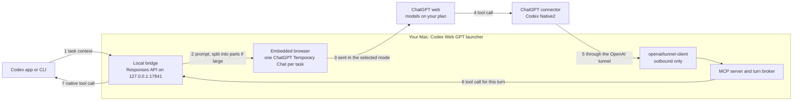

# Codex Web GPT — trukhinyuri fork

Use the ChatGPT models on your ChatGPT plan, from Instant to Pro, as models inside [Codex](https://developers.openai.com/codex) (app and CLI). Codex keeps its files, tools, approvals and tasks; ChatGPT web answers each turn through a local bridge and the launcher's embedded browser.

This fork of [miuuyy/codex-chatgpt-web](https://github.com/miuuyy/codex-chatgpt-web) fixes failures seen in daily use, installs from source on macOS, and updates itself from this repository's `main` branch only after the full test suite passes.

[Quick start](#quick-start) · [Set up with an AI agent](#set-up-with-an-ai-agent) · [How it works](#how-it-works) · [What this fork changes](#what-this-fork-changes) · [Updates](#updates-and-rollback) · [Troubleshooting](#troubleshooting)

## Quick start

On macOS (Apple silicon or Intel) with Git, Node.js and Bun 1.4.0:

```bash
curl -fsSL https://raw.githubusercontent.com/trukhinyuri/codex-chatgpt-web/main/scripts/install-fork-macos.sh | bash
```

The script clones this repository into `~/.codex-chatgpt-web-source`, runs `bun run verify` (all tests), packages the app, installs **Codex Web GPT** into `/Applications`, and ends with `RESULT installed commit=…`. It tells you exactly what to install if a prerequisite is missing.

Then, in the launcher:

1. Sign in to ChatGPT in the embedded browser and run **Run browser smoke test**.
2. Press **Install models**, restart Codex once, and choose a **ChatGPT Web — …** model (Instant, Medium, High, Extra High or Pro, as your plan allows).
3. For file, terminal and patch tools, open **MCP**: create a Tunnel and an API key in the OpenAI platform, press **Connect harness**, enable ChatGPT Developer Mode, add a Tunnel connector named exactly **Codex Native2** (Authentication: None, Allow all actions), then press **Verify runtime**.
4. For long tasks, turn on **Settings → Bigger Context** and restart Codex. The Pro window grows to 336,579 tokens, with compaction at 285,000.

## Set up with an AI agent

Paste one of these prompts into Codex or Claude Code on the Mac you are setting up. The agent follows [AGENTS.md](AGENTS.md). It never types passwords, codes or API keys: you sign in and paste secrets yourself.

**Install and configure**

```text
Install and configure Codex Web GPT from https://github.com/trukhinyuri/codex-chatgpt-web on this Mac.
Follow the repository's AGENTS.md. Run the installer with WAIT_FOR_IDLE=1, install any prerequisite it
names, and report its RESULT line. Then use Computer Use to walk me through the launcher: I sign in to
ChatGPT and paste the Tunnel ID and API key myself; you run the smoke test, Install models, Connect
harness and Verify runtime, and tell me when to restart Codex. Finish with the checks in AGENTS.md
("Verify") and report each result, including anything that failed.
```

**Verify an existing install with Computer Use**

```text
Verify Codex Web GPT on this Mac using the "Verify" section of AGENTS.md in
https://github.com/trukhinyuri/codex-chatgpt-web. Run doctor, send one test turn with a ChatGPT Web model,
and use Computer Use to screenshot the launcher's Browser view while the turn runs and confirm that the
ChatGPT composer shows the same mode as the model you chose. Do not quit the launcher while a turn is
running. Report every check as passed or failed, with the exact error text.
```

**Update without interrupting work**

```text
Update Codex Web GPT to the latest main of https://github.com/trukhinyuri/codex-chatgpt-web without
interrupting running Codex work: follow the "Update" section of AGENTS.md, then run doctor and report the
installer's RESULT line.
```

## How it works



1. Codex sends the task to the local bridge exactly as it would send it to OpenAI.
2. The bridge compiles the context and hands it to a ChatGPT tab in the launcher. With Bigger Context, a large context travels in two or three messages.
3. ChatGPT answers in the mode you picked in Codex. The answer and reasoning summaries stream back to Codex.
4. In Full harness mode, ChatGPT calls Codex tools through the **Codex Native2** connector. The call reaches your Mac through an outbound tunnel, so no port is opened.
5. The bridge turns the call into a native Codex tool call. Codex runs it with its own sandbox and approvals and sends the result back into the same ChatGPT response.

Browser-only mode stops after step 3 and has no local tools. Zero Risk mode lets you paste and send each prompt yourself. Details: [architecture](docs/architecture.md) and [security model](docs/security-model.md).

## What this fork changes

| Area | Upstream 5.0.8 | This fork |
| --- | --- | --- |
| Skills outside Git, or in a project with several folders | The turn fails with "ChatGPT web turn is missing cwd in trusted Codex environment context" | Works. Extra folders are trusted only when Codex itself labels the environment and the skill |
| "Too many requests" | The turn fails at once; Codex retries within seconds and deepens the limit ([#547](https://github.com/miuuyy/codex-chatgpt-web/issues/547)) | An account-wide pause of 60, 120, 240, then 300 s; Codex waits the stated delay, and no request reaches ChatGPT meanwhile |
| "Something went wrong" right after a rate limit | Retried within a second | Treated as the same limit, so Codex waits |
| Compaction during a rate limit | Fails with "ChatGPT did not complete the context handoff" ([#556](https://github.com/miuuyy/codex-chatgpt-web/issues/556)) | Returns the rate limit with its delay; Codex retries after it |
| Bigger Context | Context parts go in Instant; only the last part uses the selected mode | Every part uses the selected mode, which is checked again before the last part |
| A tool call that ChatGPT stops before it runs | The model may blame Codex auto-review or the target service | The model reports that ChatGPT stopped the call and that it never reached Codex |
| Updates | Offers upstream release packages | Builds this repository's `main`, runs the full test suite, installs only while Codex is idle |
| Installation | Release installers | `scripts/install-fork-macos.sh` builds from source; `WAIT_FOR_IDLE=1` never interrupts work |
| AI agents | — | [AGENTS.md](AGENTS.md) runbook for setup, verification and updates |

Each fix meant for upstream lives in its own `fix/…` branch with a regression test.

## Updates and rollback

- **In the launcher.** It checks `main` at start and every six hours and offers **Update to v5.0.8+‹commit›**. The update builds that exact commit in `~/.codex-chatgpt-web-source`, runs `bun run verify`, packages the app and checks the package's commit. If any step fails, the installed app stays and the details go to `~/Library/Application Support/Codex Web GPT/logs/source-update.log`. The new app replaces the old one only after Codex has had no active ChatGPT Web turn for 30 seconds.
- **From a terminal.** Rerun the quick-start command with `WAIT_FOR_IDLE=1` before `bash`.
- **Rollback.** The first app the installer replaces is kept in `~/.cache/ccw-app-official.noindex`; later ones go to the Trash. Quit the launcher and move one back into `/Applications`.
- **Trust.** An update runs this repository's build and tests on your Mac, as the installer does. Only the maintainer can push to `main`.

## Requirements and limits

- **Platform.** The installer and in-app updates support macOS. On Windows or Linux, build from source (below) or use the upstream releases, which do not contain these changes.
- **Account.** Any ChatGPT plan; the available modes depend on the plan. Full harness mode also needs an OpenAI platform account for the Tunnel and API key.
- **Automation.** This drives ChatGPT web in a browser; it is not an OpenAI API. A ChatGPT UI change can break it, and it then fails with an explicit error instead of switching model or mode.
- **Limits and safety checks.** ChatGPT's message limits, rate limits and safety checks apply as usual. The bridge waits them out and never bypasses them.
- **Affiliation.** Independent software, not affiliated with or endorsed by OpenAI. Use it with your own account and within the [OpenAI Terms of Use](https://openai.com/policies/terms-of-use/).

## Troubleshooting

| Message in Codex | Meaning | What to do |
| --- | --- | --- |
| `ChatGPT rate limit … Please try again in Ns` | ChatGPT is throttling the account | Nothing: Codex waits and retries. Fewer parallel tasks and subagents help |
| ChatGPT stopped a tool call before it ran | ChatGPT's own check stopped the call; it never reached Codex | Rephrase the request as one clear operation, or run that step with a native Codex model |
| `exceeds the measured … ChatGPT browser message boundary` | The context no longer fits one message | Turn on Bigger Context, or run `/compact` |
| `Connection refused` on `127.0.0.1:17841` | The launcher is not running | Open Codex Web GPT |

More: [TROUBLESHOOTING.md](TROUBLESHOOTING.md), **Activity** and **Settings → Run doctor** in the launcher.

## Develop

Building from source requires Bun 1.4.0 exactly.

```bash
git clone https://github.com/trukhinyuri/codex-chatgpt-web.git
cd codex-chatgpt-web
bun install --frozen-lockfile && (cd launcher && bun install --frozen-lockfile)
bun run verify
bun run app
bun run app:package
```

`bun run verify` is the gate for `main`: the launcher's updater installs nothing that fails it. Fixes meant for upstream start from `upstream/main` in a `fix/…` branch; fork-only changes start from `main`. See [CONTRIBUTING.md](CONTRIBUTING.md) and the [DEV chat harness](docs/dev-chat.md).

The upstream README and its translations are in [docs/upstream](docs/upstream/README.md).

## Credits and license

- Fork maintained by Yuri Trukhin ([@trukhinyuri](https://github.com/trukhinyuri)), <yuri@trukhin.com>.
- Based on [Codex Web GPT](https://github.com/miuuyy/codex-chatgpt-web) by [miuuyy](https://github.com/miuuyy) and its contributors.
- Released under the [MIT License](LICENSE); the original copyright notice is kept. Third-party notices are in [LICENSES](LICENSES).
